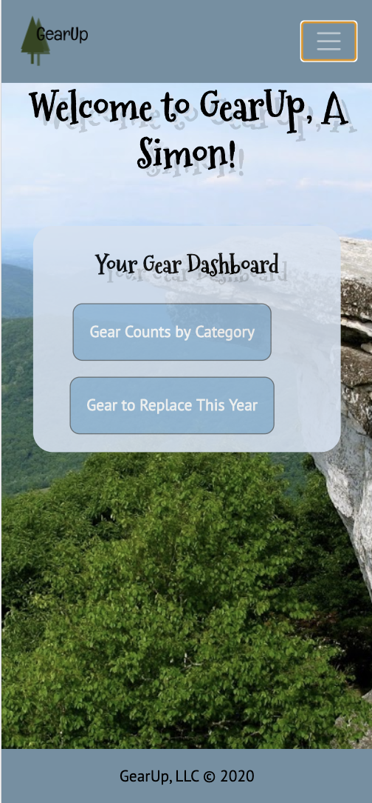
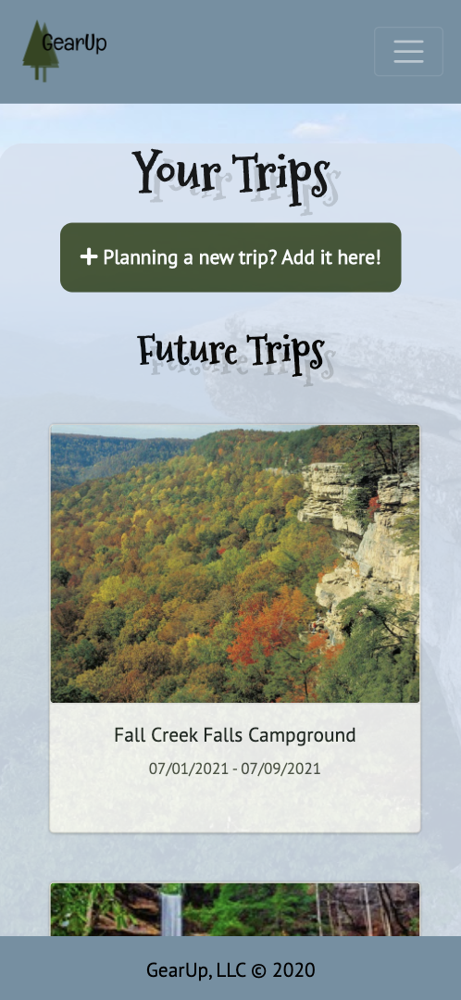

# GearUp
[Check it out here!](https://frontendcapstone-ae7be.web.app/auth)

## Description
Never let the stress of packing prevent you from making great camping and backpacking memories again!
GearUp helps you manage your camping gear, create packing lists for new trips in seconds, and keep track of your trips and gear over time. 
It is a single-page React application with CRUD functionality and uses Firebase for database management, Google Sign-in authentication, and hosting. 

## Background
How many times have you thought about going on a weekend backpacking trip and then felt overwhelmed at the thought of having to figure out everything you need to take? You may even get over that initial hurdle and start making your list, but then you keep thinking of items to add to your list when you are at work or playing with the park with your kids and don’t have your list right there with you and you know you will forget to add that one thing you just thought about? And then despair again - Why does it have to be so difficult to just get out in nature and away from it all for a few days?  

It doesn’t have to be! The GearUp app is here to help make your backpacking dreams come true effortlessly! You can add all your current backpacking gear, list the purpose and details for each and snap, the next time you want to go on a trip, your packing list is ready in a sec! 

It was exciting to work with a topic I loved and to have the real-life need of a problem I was trying to solve drive the development decisions and choices I was making. It was amazing to be able to complete in a couple of hours pieces of CRUD functionality that at one point had taken me days. It was amazing to pull data from multiple Firebase data collections simultaneously more effortlessly than my first similar attempts during earlier projects. It was amazing to try new techniques and find out how much more sense stackoverflow.com makes now that my foundational development knowledge has grown significantly. Yes, there were hurdles. Managing the multiple Firebase collections my project required in order to track gear data was still difficult. Filtering data in React helped me further practice and understand how to manipulate the DOM via variables in state. And yes, there are several features I did not get to complete in this round. With its challenges and accomplishments, my frontend capstone experience truly felt like reaching the McAfee Knob peak you can see in the app’s background. 

## Tools & Technologies
Axios, Bootstrap, CSS, ES6 Modules, Firebase (for authentication, data management, and hosting), FreeLogoDesign, Github (for version control and project management), Google login authentication, HTML5, JavaScript, jQuery, JSX, Lucidchart, moment.js, moqups, React, React Router, reactstrap, REST API,  Sass, sweetalert2, Webpack

## Features
1. Users can track new gear they buy and details about each such as the function it meets, brand, model, if it can be used only at an established campsite or anywhere, a photo, manufacture year, expiration year, weather, season(s), party(ies), and of course, weight for those ultra-light  enthusiasts. The Function, Item (description), and Brand fields are required to ensure accurate data is recorded.
1. Users have access to a dashboard on the Home page with statistics about their gear, such as the count of gear by function and gear that is set to expire this year. 
1. Users can view all their gear on the Gear page, which is initially filtered automatically to display only available gear but can be refiltered to display only gear for a specific function, or  gear  for a specific weather type, or gear set to expire during a certain year.
1. Users can view all the details of a piece of gear on the single gear page. 
1. Users can edit gear items. 
1. Users can delete gear items and have to confirm their action before the item is deleted. 
1. Users can plan a new trip and record details such as destination, dates, whether they are going to an established campsite or not, photo, weather expected, season, and party going. The Destination, Start Date, and End Date fields are required to ensure accurate data is recorded.
1. When planning a new trip, users can also select the gear they want to take along to make the easiest and quickest packing list they have ever made for any trip in their lifetime!
1. Users can view all their trips on the Trips page, organized by date into Future Trips and Past Trips sections.
1. Users can view all the details of a trip, including their packing list and their total pack weight, on the single trip page. 
1. Users can edit trip data. 
1. Users can delete trips and have to confirm their action before the trip is deleted. 
1. Users have access to a Reports page with statistics about their gear.
1. Both authenticated and unauthenticated users can learn about the app on the About Us page. 
1. GearUp is designed to be responsive and mobile-friendly. 

## Screenshots
#### Login Page

#### About Us Page

#### Home Page for Authenticated Users

#### Gear Page

#### Future Trips on the Trips Page

#### Past Trips on the Trips Page

#### Reports Page

#### Creating a New Gear Item

#### Validation When Creating a New Gear Item

#### Viewing Details for a Gear Item

#### Editing Details for a Gear Item

#### Confirmation When Deleting a Gear Item

#### Creating a New Trip

#### Validation When Creating a New Trip

#### Viewing Details of a Trip

#### Viewing the Packing List for a Trip

#### Editing Details for a Trip

#### Confirmation When Deleting a Trip

#### Home Page on Mobile

#### Gear Page on Mobile

#### Trips Page on Mobile

## How to Run
1. Clone down this repo.
1. Make sure you have http-server installed via npm. If not, get it [here](https://www.npmjs.com/package/http-server).
1. On your command line, run `hs -p 9999`.
1. In your browser, navigate to `http://localhost:9999`.

## Firebase Deployment
This project has been deployed with Firebase. 
You can access it [here](https://frontendcapstone-ae7be.web.app/auth). 

